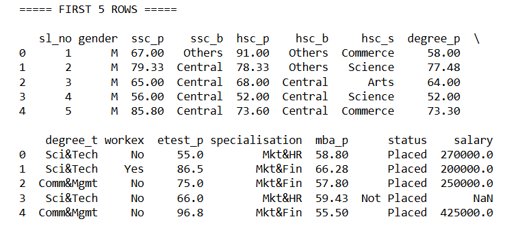
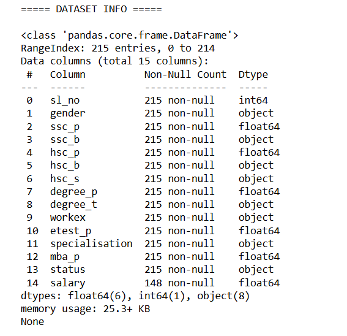
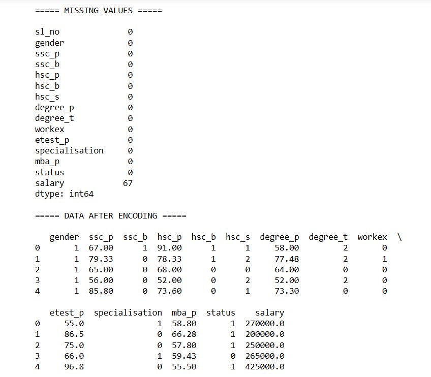
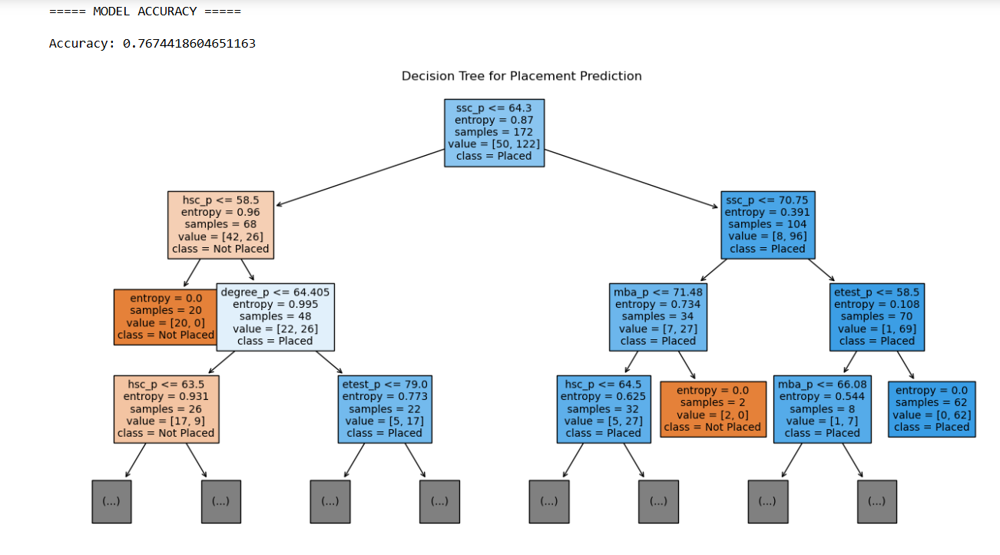

# Implementation-of-Decision-Tree-Classifier-Model-for-Predicting-Employee-Churn

## AIM:
To write a program to implement the Decision Tree Classifier Model for Predicting Employee Churn.

## Equipments Required:
1. Hardware – PCs
2. Anaconda – Python 3.7 Installation / Jupyter notebook

## Algorithm
1.Import the required Python libraries such as pandas, sklearn, and matplotlib.

2.Load the dataset and check for missing values and data types.

3.Encode categorical variables and select the input features and target variable.

4.Split the dataset into training and testing sets and train the Decision Tree Classifier model.

5.Predict the test data, calculate the accuracy, and display the Decision Tree visualization. 

## Program:
```
/*
Program to implement the Decision Tree Classifier Model for Predicting Employee Churn.
Developed by: SAI KRIPA SK
RegisterNumber:  212224040284
*/

import pandas as pd
import matplotlib.pyplot as plt
from sklearn.tree import DecisionTreeClassifier, plot_tree
from sklearn.preprocessing import LabelEncoder
from sklearn.model_selection import train_test_split
from sklearn import metrics

# Load dataset
data = pd.read_csv(r"C:/Users/admin/ML/DATASET-20260129/Placement_Data.csv")

print("\n===== FIRST 5 ROWS =====\n")
print(data.head())

print("\n===== DATASET INFO =====\n")
print(data.info())

print("\n===== MISSING VALUES =====\n")
print(data.isnull().sum())

# Remove unnecessary column
data = data.drop("sl_no", axis=1)

# Fill missing salary values
data["salary"].fillna(data["salary"].median(), inplace=True)

# Encode categorical values
le = LabelEncoder()

data["gender"] = le.fit_transform(data["gender"])
data["ssc_b"] = le.fit_transform(data["ssc_b"])
data["hsc_b"] = le.fit_transform(data["hsc_b"])
data["hsc_s"] = le.fit_transform(data["hsc_s"])
data["degree_t"] = le.fit_transform(data["degree_t"])
data["workex"] = le.fit_transform(data["workex"])
data["specialisation"] = le.fit_transform(data["specialisation"])
data["status"] = le.fit_transform(data["status"])

print("\n===== DATA AFTER ENCODING =====\n")
print(data.head())

# Features
x = data[["ssc_p","hsc_p","degree_p","etest_p","mba_p"]]

# Target
y = data["status"]

# Split data
x_train,x_test,y_train,y_test = train_test_split(x,y,test_size=0.2,random_state=100)

# Model
dt = DecisionTreeClassifier(criterion="entropy")
dt.fit(x_train,y_train)

# Prediction
y_pred = dt.predict(x_test)

# Accuracy
accuracy = metrics.accuracy_score(y_test,y_pred)

print("\n===== MODEL ACCURACY =====\n")
print("Accuracy:",accuracy)

# Decision Tree Visualization (Smaller and Clear)
plt.figure(figsize=(16,8))
plot_tree(dt,
          feature_names=x.columns,
          class_names=['Not Placed','Placed'],
          filled=True,
          fontsize=10,
          max_depth=3)

plt.title("Decision Tree for Placement Prediction")

plt.show()
```

## Output:






## Result:
Thus the program to implement the  Decision Tree Classifier Model for Predicting Employee Churn is written and verified using python programming.
